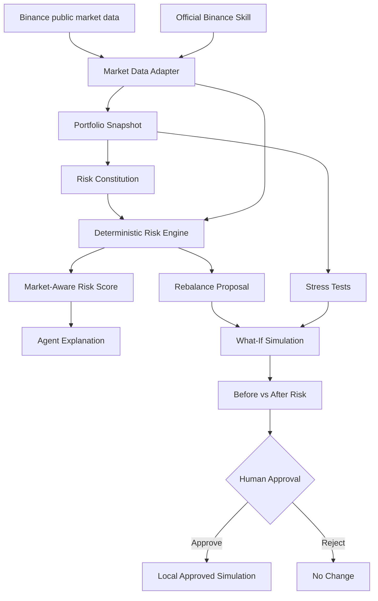

# Binance Sentinel

**Binance Sentinel** is a safety-first portfolio risk agent built for **Binance Agent OS Track A**.

It combines live Binance market data, a user-defined **Risk Constitution**, deterministic portfolio-risk analysis, stress testing, explainable agent reasoning, simulated rebalancing, and an explicit human approval gate.

> Competition prototype boundary: Sentinel does **not** connect to a Binance account, does **not** require an API key for the current demo, and does **not** place real trades.

## Why Sentinel

Most trading agents optimize for action. Sentinel optimizes for **safe decision quality before action**.

The agent is designed around a simple principle:

> Observe the market → enforce user rules → explain the risk → simulate the action → require human approval.

This makes Sentinel useful as a portfolio-risk copilot rather than an autonomous black-box trading bot.

## Track A workflow fit

Sentinel currently demonstrates two Agent Workflow categories:

- **Data & Analysis** — live market data, portfolio insights, market-aware risk scoring, stress testing.
- **Trading Workflows** — rebalance strategy generation, simulated action preview, human approval workflow.

Payment and on-chain execution are intentionally outside the scope of this prototype.

## Core capabilities

- Live BTC/USDT, ETH/USDT, and BNB/USDT market data.
- User-defined maximum single-asset allocation.
- User-defined minimum stablecoin reserve.
- Deterministic concentration-risk detection.
- Market-aware risk score from 0–100.
- Explainable **Observe → Reason → Plan → Guardrails** agent panel.
- Portfolio stress-test scenarios.
- Simulated rebalance preview.
- Before-vs-after risk comparison.
- Explicit **Approve / Reject** human decision gate.
- Official Binance Skill detection with public REST fallback.
- Curated one-click competition demo scenarios.

## Competition demo

Run the dashboard and choose:

**Competition demo — concentrated risk**

The scenario intentionally creates a BTC-heavy portfolio with insufficient stablecoin reserve so reviewers can see the complete Sentinel loop:

1. Detect a Risk Constitution violation.
2. Calculate market-aware risk.
3. Explain why the portfolio is risky.
4. Generate a rebalance proposal.
5. Stress-test and simulate the proposal.
6. Compare before and after risk.
7. Require explicit human approval.
8. Stop before live execution.

## Architecture



See [`docs/ARCHITECTURE.md`](docs/ARCHITECTURE.md) for the full architecture and safety boundary.

## Safety model

Sentinel separates reasoning from authority.

```text
Live market evidence
        ↓
Risk Constitution
        ↓
Deterministic risk engine
        ↓
Explainable agent reasoning
        ↓
What-if simulation
        ↓
Human approval
        ↓
STOP — no live execution in this prototype
```

The reasoning layer cannot override the Risk Constitution. Approval only changes local simulation state.

## Binance Agent OS / Skills integration

The repository includes a Sentinel skill definition at:

```text
.agents/skills/binance-sentinel/SKILL.md
```

The official Binance `binance` Skill can also be installed locally through Binance Skills Hub. Sentinel detects that installation and can use the Binance CLI when available. If the CLI is unavailable, the dashboard continues using public Binance REST market data so the demo remains functional.

## Run locally on Windows

### Requirements

- Python 3.11+
- Git

### Clone

```powershell
git clone https://github.com/whyfishcanswim/binance-sentinel.git
cd binance-sentinel
```

### Create a virtual environment

```powershell
python -m venv .venv
.venv\Scripts\activate
```

### Install dependencies

```powershell
pip install -r requirements.txt
```

### Launch the competition dashboard

```powershell
streamlit run dashboard.py
```

Then open:

```text
http://localhost:8501
```

## Version history

- **v0.1** — Binance MCP connection experiment and diagnostics.
- **v0.2** — local portfolio risk engine and stress tests.
- **v0.3** — interactive Risk Constitution.
- **v0.4** — Streamlit browser dashboard.
- **v0.5** — live public Binance market data.
- **v0.6** — market-aware risk score.
- **v0.7** — explainable agent reasoning layer.
- **v0.8** — simulated rebalance preview.
- **v0.9** — human approval workflow.
- **v0.10** — Binance Agent OS / Skills integration.
- **Competition build** — polished UI, demo scenarios, explanation panel, documentation, and architecture diagram.

## Repository structure

```text
binance-sentinel/
├── app/
│   ├── agent_os.py
│   ├── approval.py
│   ├── constitution.py
│   ├── demo_scenarios.py
│   ├── market_data.py
│   ├── market_risk.py
│   ├── reasoning.py
│   ├── risk_engine.py
│   ├── sample_data.py
│   ├── simulation.py
│   └── stress_test.py
├── docs/
│   └── ARCHITECTURE.md
├── .agents/skills/binance-sentinel/
│   └── SKILL.md
├── dashboard.py
├── main.py
├── requirements.txt
└── setup-agent-os.ps1
```

## Disclaimer

Binance Sentinel is an experimental hackathon prototype for educational and demonstration purposes. Its outputs are not financial advice, investment advice, or a recommendation to buy, sell, or hold any asset. Digital assets are volatile and users are responsible for their own decisions.
