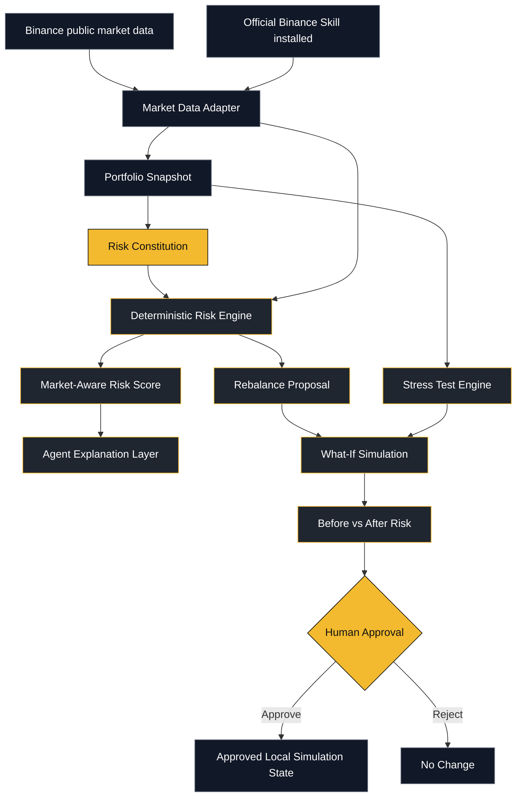

# Binance Sentinel Architecture

## Safety boundary

Sentinel v0.10 does not authenticate to a Binance account and does not place real orders. The current execution boundary ends at **human-approved local simulation**.

## Agent loop

1. **Observe** — read public Binance market data and portfolio inputs.
2. **Check** — apply the user's Risk Constitution.
3. **Reason** — explain why risk is elevated or acceptable.
4. **Simulate** — preview a rebalance and rerun risk/stress checks.
5. **Approve** — require an explicit human decision.
6. **Stop** — no live execution is enabled in the competition prototype.
